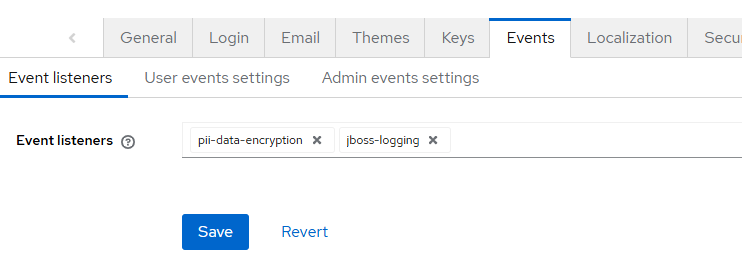
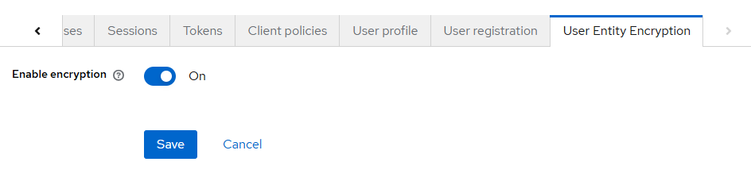
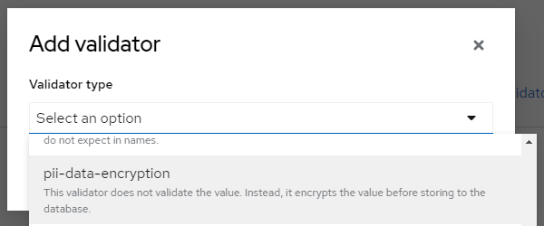

# Keycloak PII Data Encryption Provider

## Introduction

This provider encrypts user fields & attribute values before storing them to the database and decrypt them upon loading from the database. This is to address data security regulations such as GDPR that require any PII data to not be stored in plain/raw format at rest.

***Important: this provider supports Keycloak version 24.x and above only.*** 

## How to install

### Manual install

Git clone this repo:

```shell
git clone https://github.com/MLukman/Keycloak-PII-Data-Encryption-Provider.git Keycloak-PII-Data-Encryption-Provider
cd Keycloak-PII-Data-Encryption-Provider
```

Compile this provider into a JAR file using the following command. JDK 17 or above and Maven are required to be pre-installed on the machine. Make sure to match the `keycloak.version` parameter with the version of the target Keycloak.

```shell 
mvn clean package -Dkeycloak.version=26.1.1
```

Copy paste the packaged JAR file from inside `target` folder into Keycloak `providers` folder. Run `kc.sh build` command to get Keycloak to register this provider.

### Install inside Docker Image

Use this method if this provider needs to be pre-packaged inside a custom Keycloak Docker image. Below is a sample Dockerfile:

```dockerfile
# ARG defined before FROM in multi-staged Dockerfile is shared among the stages
ARG KEYCLOAK_VERSION=26.1.1

# Build the provider
FROM maven:3.8.1-openjdk-17-slim AS keycloak-pii-data-encryption
ARG KEYCLOAK_VERSION # Dockerfile peculiarity that requires ARG defined before FROM to be re-declared afterwards if we want to use it in the stage
WORKDIR /app
RUN apt-get update && apt-get install -y git && apt-get clean
RUN git clone https://github.com/MLukman/Keycloak-PII-Data-Encryption-Provider.git .
RUN mvn clean package -Dkeycloak.version=$KEYCLOAK_VERSION

################################################################################

# Base image from official keycloak
FROM quay.io/keycloak/keycloak:$KEYCLOAK_VERSION

# Add provider JAR
COPY --from=keycloak-pii-data-encryption /app/target/*.jar /opt/keycloak/providers

# Need to build after adding providers
RUN /opt/keycloak/bin/kc.sh build --db=mysql --features="declarative-ui" --spi-user-provider=jpa-encrypted

```

## How to use

### Setting the encryption key

This provider requires the encryption key to be provided via environment variable **`KC_PII_ENCKEY`** and it needs to be **at least 16 characters long**. There is, however, a default fallback that uses MD5 hash of environment variable `KC_DB_URL` if the encryption key is not provided. If you rely on this fallback and in the future need to migrate your Keycloak data into another databases that results in a different value of `KC_DB_URL`, you need to get the old value of `KC_DB_URL`, encode it using lowercased MD5 hash and set the value to the `KC_PII_ENCKEY` environment variable.

### Enabling 'jpa-encrypted' user provider and 'declarative-ui' feature

Starting with version 2.0, this provider requires the Keycloak instance to be either built or started with two flags:

-  `--spi-user-provider=jpa-encrypted`
- `--features="declarative-ui"`

These flags can be added to the `build` command with a condition that the `start` command has the `--optimized` flag, or for `start` without that flag or `start-dev` command, the two flags are to be added to the `start` or `start-dev` commands.

Note: the "declarative-ui" flag is only necessary while the feature is still considered experimental. Once it is enabled by default in future Keycloak versions, the flag will no longer be necessary.

### Adding the pre-requisite event listener

The encryption needs to be enabled realm-by-realm. Firstly, this provider requires enabling an event listener for the particular realms that require data encryption. Go to the `Realm settings` page and navigate to the `Events` tab. Add the event listener `pii-data-encryption`, as shown below: 



### Enabling the encryption

To actually enable the encryption of the common user attributes `username`, `email`, `first name` and `last name` for users in a particular realm, go to the `Realm settings` page and navigate to the custom tab `User Entity Encryption`. Turn on the `Enable encryption` switch on that tab, as shown below:



### Extending the encryption to custom attributes

To enable encryption of any custom attributes, go to the `User profile` tab and click on the specific attributes and add the custom validator of type `pii-data-encryption` under the `Validations` section.



This provider also automatically encrypts any user attributes that have their names start with "pii-" prefix even without the validator.

### Verifying if the profile data are really encrypted (also explanations on how the encryptions work)

1. Browse the Keycloak database using any tool (e.g. phpMyAdmin for MySQL database).
2. Navigate to the table `USER_ENTITY`. Verify that the columns `USERNAME`, `EMAIL`, `FIRST_NAME` and `LAST_NAME` for the rows corresponding to users that have the encryption enabled will contain 40-characters of hexadecimal hash values, e.g. `6ea7bdc669b8926a75fe165989270ed025ac94dd`. Those hash values will be used for searching users based on those columns.
3. Navigate to the table `USER_ENTITY_ENCRYPTED` to verify that those corresponding columns contain the encrypted values in the format of Base-64 strings that start with `$$$`, e.g. `$$$4SfpYL5c5rkn69b...` (the length may varies). Those encrypted values will be decrypted into the original values for Keycloak to show on UI or return in API responses.
4. Navigate to the table `USER_ATTRIBUTE`. Verify that the column `VALUE` for the rows corresponding to user attributes that have the encryption enabled contains a 40-characters of hexadecimal hash value, similar to the columns in `USER_ENTITY` table.
5. Navigate to the table `USER_ATTRIBUTE_ENCRYPTED` to find the corresponding `VALUE` column contains the Base-64 encrypted strings, similar to the columns in `USER_ENTITY_ENCRYPTED` table. 

## Known issues/limitations

1. Requires Keycloak version 24.x and above.
2. [Unmanaged attributes](https://www.keycloak.org/docs/latest/server_admin/#_understanding-managed-and-unmanaged-attributes) are not supported.
3. Encrypted user fields/attributes can only be searched using exact matches. Fuzzy-search is no longer possible for them.
4. If the encrypted values in the database cannot be decrypted for whatever reason, the hashed value of the fields/attributes will be displayed as-is to the users and clients. This may cause confusions.
5. If the `pii-data-encryption` validator is added to an existing attribute, the encryption is only applied to existing users' attribute data either when they are updated by the users, or if you switch the `Enable encryption` switch inside `User Entity Encryption` tab off and then on again.

## Your contributions will be very much appreciated

### Issues

Please use the GitHub issues to report any issues you encounter when using this provider.

### Donation

Should you benefit from this Keycloak provider, I'd appreciate if you can buy me a coffee by clicking this button >>> [](https://github.com/sponsors/MLukman)
